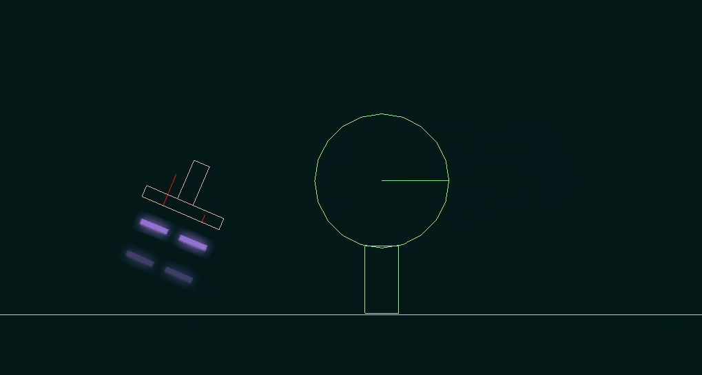

LeapHover
=========

A Leap Motion controlled hoverboard game (*also playable with a keyboard*).

## Demo

To try it out, head over to the [releases page](https://github.com/merlinND/LeapHover/releases) and download the latest archive. Things should run easily, there's nothing to install.

## About the project

This game was made as an academic side-project. It is intended as a prototype / proof-of-concept.

## About the game

The main target is to go as far as possible without crashing into a tree or a rock. Levels are generated as you play, so there's nothing standing between you and a high score!

### Controls

#### Leap Motion

Use your left hand to control the hoverboard's motion. Laying it flat will keep the current inclination of the board. **Tilt** it towards the screen to move forward in the level, and away from the screen to move back.

**Lower your hand** to start charging a jump. Move it up quickly to perform the jump.

Use one finger to **draw** arbitrary platforms in order to help you cross gaps or leap over hard obstacles.

#### Keyboard

The same moves are mapped to these keys:

- `A`, `D`, `left`, `right`: tilt left or right
- `S`, `down`: charge jump (release to jump)
- `enter`: retry level
- `click` and `drag` with the mouse to draw platforms

## Libs

- [LibGDX](http://libgdx.badlogicgames.com/) (including jBox2D and LWJGL) as our game framework and physics engine. It turns out we simply used Box2D's debug renderer to display world objects...
- [Leap Motion API](https://developer.leapmotion.com/v1) for Leap Motion support